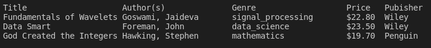

<center>
<h1>
In The Name Of God
</h1>
<h2>
Advanced Programming - Homework 2
</h2>
<h2>
Dr.Amir Jahanshahi
</h2>
<h3>
Deadline: Tuesday, 4 Aban - 23:59
</center>

# Introduction
  Hi every one🙋‍♂️.\
   In this homework you will be define some classes in C++ and help Ahmad agha to sort and categorized his bookshelf.\
He has a csv file that it shows details of his books.\
At first like HW1 you should read that csv file and store it in vector of string vector.\
<b>Note</b>: Suppose this type definition in this homework.
```c++
typedef std::vector<std::vector<std::string>> Dataframe;
```
then define below function.
```c++
Dataframe table = read_csv(std::string filename);
```
At first you need to define some classes:
- Book
- Author
- Publisher 

# Book Class
This class represents each Book. It has the following method and member variables.

```c++
class Book{
    public:
        Book(std::string _title,
             std::string _genre,
             double _price);

        void setAuthor(const Dataframe* table);
        void setPublisher(const Datafram* table);
    private:
        std::string title;
        std::string genre;
        double price;

        Author& authors;
        std::unique_ptr<Publisher> publisher;
};
```
# Author Class
This class represents each Author. It has the following method and member variables.
```c++
class Author{
    public:
        Author(std::string _name);
        void setListOfBooks(Dataframe* table);
    private:
        std::string name;
        std::vector<Book&> list_of_books;
};
```

# Publisher Class
This class represents each Publisher. It has the following method and member variables.
```c++
class Publisher{
    public:
        Publisher(std::string _name);
        void setListOfBooks(Dataframe* table);
        
    private:
        std::string name;
        std::vector<Book&> list_of_books;
        
};
```

# Making Objects
Ok after you define classes you need to create objects.Thus,you should at first define list of authors and list of publishers and then define list of Books.
```c++
std::vector<Author> defineAuthors(Dataframe* Table);
std::vector<Publisher> definePublishers(Dataframe * Table);
std::vector<Book> defineBooks(Dataframe* Table);
```

after all definitions you should write a function to sort the books by their price(ascending).
```c++
void sortBooksByPrice(std::vector<Book> & list_of_books );
```
to show table declare a function like below:
```c++
void showTable(Dataframe* table,int start, int stop);
```


DO NOT change main.cpp. 

You should create <u>Makefile</u>.


</h3>
